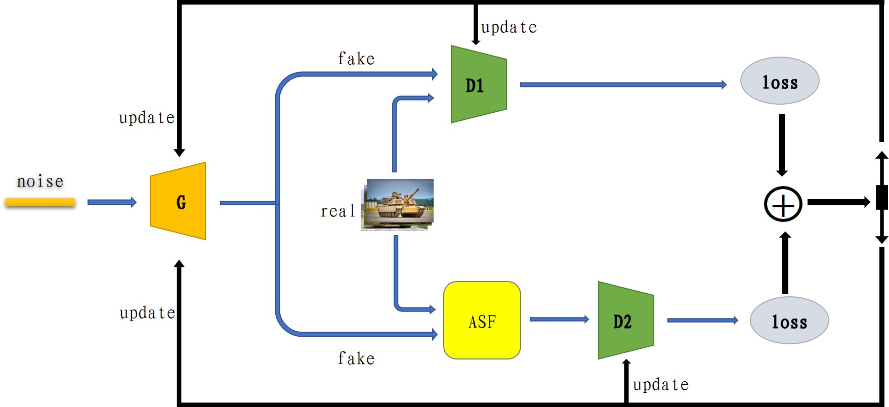

# The Dual-way Discriminator based Generative Adversarial Network with limited Tank Images


## Paper



## Abstract
Data-driven is a prerequisite for applying intelligent algorithms. Thanks to the development of GANs, many research fields use the high-quality generated images as training data, but for special fields such as the medicine and the military, it is difficult to obtain sufficient effective training images, which hinders the application and deployment of intelligent algorithms. Generating high-quality target images from the limited images is the focus of current research on GANs, and is an important means to accelerate the development of intelligent algorithms and alleviate the problem of data collection. Small datasets trend to cause the discriminator to fall into overfitting, resulting in low-quality images. A dual-way discriminator model based on a dynamic structure extraction module is proposed to improve the quality of images generated by the GANs. Compared with the 4 state-of-the-art models using data augmentation or optimization cost function, this paper synthesizes the loss of a dual-way discriminator, prevents the model from falling into overfitting through the mechanism of mutual guidance supervision, and uses dynamic Laplace convolution verification to process the training data to improve the integrity of the target structure in the generated image. A limited dataset of 3888 tank images was collected and provided, multi-angle comparison and self-ablation experiments were carried out, the image quality generated by the proposed algorithm was improved by at least 12.15%, and the training process had better robustness, and the comprehensive results showed the effectiveness of the proposed model in the task of generating tank images.
## Installation
1. Clone the repo:
```bash
git clone https://github.com/airy975924806/DDG.git
```

2. Install environment from the environment.yml file:
```bash
conda env create -f DDG.yml
```
3. Download the TankDataSets

    TankDataSets(https://www.kaggle.com/datasets/airy975924806/tank-for-ddg)


4. Create ZIP archive using `dataset_tool.py` from this repository:
   

     python dataset_tool.py --source=/path/to/TankDatasets --dest=~/tank.zip --width=256 --height=256
### Training and Evaluation with DA
To train and evaluate over TankDataSet:
```bash
conda activate DDG
sh Scripts/train_tank.sh # Ref FID 10.38
sh Scripts/train_tank_forward.sh # Ref FID 19.08
sh Scripts/train_tank_gamma0.1.sh # Ref FID 16.99
```


 ## Related Works
 We also would like to thank great works as follows:
 - https://github.com/NVlabs/stylegan2-ada-pytorch


## Contact
If you have any questions, please contact: airy_sonw@outlook.com
